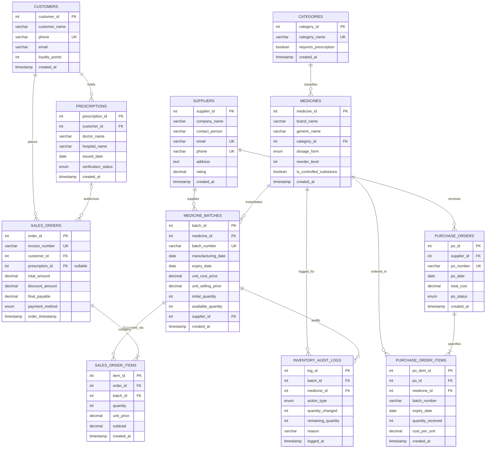

# Entity Relationship Diagram (ERD) & Data Dictionary

**Project**: Pharmacy Expiry & Batch-Wise FIFO Inventory Database System  
**Engine**: MySQL 8.0+ / MariaDB 10.4+ (InnoDB Engine)  
**Normalization Standard**: Third Normal Form (3NF)  
**Repository**: [pharmacy-inventory-fifo-database-project](https://github.com/affaan-891/pharmacy-inventory-fifo-database-project)

---

## 1. Visual Entity Relationship Diagram (Mermaid Crow's Foot)

The following diagram illustrates the 11 relational entities, their primary keys (`PK`), foreign keys (`FK`), and relational cardinality using Crow's Foot notation.

---

## 2. Comprehensive Data Dictionary

### 2.1 Table: `suppliers`
Tracks verified pharmaceutical manufacturers and wholesale distributors.

| Column Name | Data Type | Constraints | Description |
| :--- | :--- | :--- | :--- |
| `supplier_id` | `INT` | `PK`, `AUTO_INCREMENT` | Unique identifier for supplier |
| `company_name` | `VARCHAR(150)` | `NOT NULL` | Registered trading name |
| `contact_person`| `VARCHAR(100)` | `NOT NULL` | Primary account representative |
| `email` | `VARCHAR(100)` | `NOT NULL`, `UNIQUE` | Official corporate email address |
| `phone` | `VARCHAR(25)` | `NOT NULL`, `UNIQUE` | Business telephone / helpline |
| `address` | `TEXT` | `NOT NULL` | Physical headquarters / warehouse address |
| `rating` | `DECIMAL(2,1)` | `CHECK(rating BETWEEN 1.0 AND 5.0)` | Quality and reliability score |
| `created_at` | `TIMESTAMP` | `DEFAULT CURRENT_TIMESTAMP` | System onboarding timestamp |

---

### 2.2 Table: `categories`
Therapeutic classifications dividing prescription pharmaceuticals from over-the-counter wellness products.

| Column Name | Data Type | Constraints | Description |
| :--- | :--- | :--- | :--- |
| `category_id` | `INT` | `PK`, `AUTO_INCREMENT` | Unique category code |
| `category_name` | `VARCHAR(100)` | `NOT NULL`, `UNIQUE` | Pharmacological category title |
| `requires_prescription` | `BOOLEAN` | `NOT NULL DEFAULT FALSE` | Flag for mandatory Rx validation |
| `created_at` | `TIMESTAMP` | `DEFAULT CURRENT_TIMESTAMP` | Creation timestamp |

---

### 2.3 Table: `medicines`
Drug formulary master table defining commercial medicines independently of physical production batches.

| Column Name | Data Type | Constraints | Description |
| :--- | :--- | :--- | :--- |
| `medicine_id` | `INT` | `PK`, `AUTO_INCREMENT` | Master product identifier |
| `brand_name` | `VARCHAR(150)` | `NOT NULL` | Trade / brand name (e.g., Amoxil) |
| `generic_name` | `VARCHAR(150)` | `NOT NULL` | Active chemical moiety (e.g., Amoxicillin) |
| `category_id` | `INT` | `FK -> categories(category_id)` | Classification link |
| `dosage_form` | `ENUM(...)` | `Tablet, Syrup, Injection, Capsule, Ointment` | Physical administration form |
| `reorder_level` | `INT` | `NOT NULL DEFAULT 50, CHECK(>= 0)` | Threshold to trigger replenishment |
| `is_controlled_substance` | `BOOLEAN` | `NOT NULL DEFAULT FALSE` | Regulatory Schedule flag (e.g., Narcotics) |
| `created_at` | `TIMESTAMP` | `DEFAULT CURRENT_TIMESTAMP` | Catalog listing timestamp |

---

### 2.4 Table: `medicine_batches`
Physical inventory ledger tracking individual manufacturing lots and expiration dates. Enables FIFO.

| Column Name | Data Type | Constraints | Description |
| :--- | :--- | :--- | :--- |
| `batch_id` | `INT` | `PK`, `AUTO_INCREMENT` | Unique inventory lot identifier |
| `medicine_id` | `INT` | `FK -> medicines(medicine_id)` | Associated drug catalog item |
| `batch_number` | `VARCHAR(50)` | `NOT NULL` | Manufacturer lot tracking code |
| `manufacturing_date` | `DATE` | `NOT NULL` | Date of synthesis/production |
| `expiry_date` | `DATE` | `NOT NULL, CHECK(expiry_date > manufacturing_date)` | Expiration date |
| `unit_cost_price` | `DECIMAL(10,2)` | `NOT NULL, CHECK(>= 0)` | Wholesale unit acquisition price |
| `unit_selling_price`| `DECIMAL(10,2)` | `NOT NULL, CHECK(>= unit_cost_price)` | Counter retail dispensing price |
| `initial_quantity` | `INT` | `NOT NULL, CHECK(> 0)` | Quantity received at batch intake |
| `available_quantity`| `INT` | `NOT NULL, CHECK(>= 0 AND <= initial_quantity)` | Current real-time available stock |
| `supplier_id` | `INT` | `FK -> suppliers(supplier_id)` | Source distributor |
| `created_at` | `TIMESTAMP` | `DEFAULT CURRENT_TIMESTAMP` | Batch registration timestamp |
| *(Composite Key)* | `UNIQUE` | `UNIQUE(medicine_id, batch_number)` | Prevents duplicate lot numbering per drug |
| *(Index)* | `INDEX` | `idx_fifo_lookup(medicine_id, expiry_date, available_quantity)` | Pessimistic FIFO scan optimization |

---

### 2.5 Table: `customers`
Patient and retail client registry tracking transaction history and loyalty points.

| Column Name | Data Type | Constraints | Description |
| :--- | :--- | :--- | :--- |
| `customer_id` | `INT` | `PK`, `AUTO_INCREMENT` | Primary client identifier |
| `customer_name` | `VARCHAR(100)` | `NOT NULL` | Full patient / client legal name |
| `phone` | `VARCHAR(25)` | `NOT NULL`, `UNIQUE` | Contact mobile number |
| `email` | `VARCHAR(100)` | `NULL` | Electronic mail address |
| `loyalty_points`| `INT` | `NOT NULL DEFAULT 0, CHECK(>= 0)` | Accumulated reward balance |
| `created_at` | `TIMESTAMP` | `DEFAULT CURRENT_TIMESTAMP` | Registration timestamp |

---

### 2.6 Table: `prescriptions`
Medical authorization credentials issued by registered medical practitioners.

| Column Name | Data Type | Constraints | Description |
| :--- | :--- | :--- | :--- |
| `prescription_id` | `INT` | `PK`, `AUTO_INCREMENT` | Unique prescription registry code |
| `customer_id` | `INT` | `FK -> customers(customer_id)` | Patient profile reference |
| `doctor_name` | `VARCHAR(100)` | `NOT NULL` | Prescribing physician full name |
| `hospital_name` | `VARCHAR(150)` | `NOT NULL` | Healthcare clinical facility |
| `issued_date` | `DATE` | `NOT NULL` | Consultation / script issue date |
| `verification_status`| `ENUM(...)`| `'Verified', 'Pending', 'Rejected'` | Pharmacist clinical verification flag |
| `created_at` | `TIMESTAMP` | `DEFAULT CURRENT_TIMESTAMP` | Scanned / entry timestamp |

---

### 2.7 Table: `sales_orders`
Header for customer purchase orders and official retail tax invoices.

| Column Name | Data Type | Constraints | Description |
| :--- | :--- | :--- | :--- |
| `order_id` | `INT` | `PK`, `AUTO_INCREMENT` | Transaction header ID |
| `invoice_number` | `VARCHAR(50)` | `NOT NULL`, `UNIQUE` | Legal tax invoice reference string |
| `customer_id` | `INT` | `FK -> customers(customer_id)` | Purchaser profile reference |
| `prescription_id` | `INT` | `FK -> prescriptions(prescription_id), NULL` | Linked medical authorization (if Rx) |
| `total_amount` | `DECIMAL(10,2)` | `NOT NULL DEFAULT 0.00, CHECK(>= 0)` | Gross item summation |
| `discount_amount`| `DECIMAL(10,2)` | `NOT NULL DEFAULT 0.00, CHECK(>= 0)` | Concession / promo deduction |
| `final_payable` | `DECIMAL(10,2)` | `NOT NULL DEFAULT 0.00, CHECK(>= 0)` | Net payable amount |
| `payment_method`| `ENUM(...)` | `'Cash', 'Card', 'DigitalWallet'` | Settlement tender channel |
| `order_timestamp`| `TIMESTAMP` | `DEFAULT CURRENT_TIMESTAMP` | Point of sale completion timestamp |

---

### 2.8 Table: `sales_order_items`
Detailed line items binding invoices directly to specific batches for precise lot-level dispensing.

| Column Name | Data Type | Constraints | Description |
| :--- | :--- | :--- | :--- |
| `item_id` | `INT` | `PK`, `AUTO_INCREMENT` | Unique item line code |
| `order_id` | `INT` | `FK -> sales_orders(order_id) ON DELETE CASCADE` | Associated invoice header |
| `batch_id` | `INT` | `FK -> medicine_batches(batch_id)` | Source batch dispensed from |
| `quantity` | `INT` | `NOT NULL, CHECK(quantity > 0)` | Units dispensed from this batch |
| `unit_price` | `DECIMAL(10,2)` | `NOT NULL, CHECK(>= 0)` | Batch retail unit price at sale |
| `subtotal` | `DECIMAL(10,2)` | `NOT NULL, CHECK(>= 0)` | Computed line total (`quantity * unit_price`) |
| `created_at` | `TIMESTAMP` | `DEFAULT CURRENT_TIMESTAMP` | Record timestamp |

---

### 2.9 Table: `purchase_orders`
Inbound commercial procurement manifests placed with wholesale drug suppliers.

| Column Name | Data Type | Constraints | Description |
| :--- | :--- | :--- | :--- |
| `po_id` | `INT` | `PK`, `AUTO_INCREMENT` | Procurement order identifier |
| `supplier_id` | `INT` | `FK -> suppliers(supplier_id)` | Target vendor |
| `po_number` | `VARCHAR(50)` | `NOT NULL`, `UNIQUE` | Inward billing tracking code |
| `po_date` | `DATE` | `NOT NULL` | Date order placed |
| `total_cost` | `DECIMAL(10,2)` | `NOT NULL DEFAULT 0.00, CHECK(>= 0)` | Cumulative expenditure |
| `po_status` | `ENUM(...)` | `'Pending', 'Received', 'Cancelled'` | Order lifecycle status |
| `created_at` | `TIMESTAMP` | `DEFAULT CURRENT_TIMESTAMP` | PO generation timestamp |

---

### 2.10 Table: `purchase_order_items`
Line items detailing individual incoming products and batches on a purchase order.

| Column Name | Data Type | Constraints | Description |
| :--- | :--- | :--- | :--- |
| `po_item_id` | `INT` | `PK`, `AUTO_INCREMENT` | Line item identifier |
| `po_id` | `INT` | `FK -> purchase_orders(po_id) ON DELETE CASCADE` | Parent procurement order |
| `medicine_id` | `INT` | `FK -> medicines(medicine_id)` | Product received |
| `batch_number` | `VARCHAR(50)` | `NOT NULL` | Manufacturer lot number |
| `expiry_date` | `DATE` | `NOT NULL` | Batch expiry stated on packaging |
| `quantity_received`| `INT` | `NOT NULL, CHECK(> 0)` | Units received |
| `cost_per_unit` | `DECIMAL(10,2)` | `NOT NULL, CHECK(>= 0)` | Unit wholesale acquisition price |
| `created_at` | `TIMESTAMP` | `DEFAULT CURRENT_TIMESTAMP` | Manifest intake timestamp |

---

### 2.11 Table: `inventory_audit_logs`
Immutable compliance journal logging every stock movement with before-and-after tracking.

| Column Name | Data Type | Constraints | Description |
| :--- | :--- | :--- | :--- |
| `log_id` | `INT` | `PK`, `AUTO_INCREMENT` | Unique journal log sequence |
| `batch_id` | `INT` | `INDEXED` | Targeted physical batch |
| `medicine_id` | `INT` | `INDEXED` | Formulary drug reference |
| `action_type` | `ENUM(...)` | `'SALE', 'RETURN', 'RESTOCK', 'EXPIRED_SCRAP', 'MANUAL_ADJUSTMENT'` | Operational event type |
| `quantity_changed`| `INT` | `NOT NULL` | Signed differential (+ for inward, - for outward) |
| `remaining_quantity`| `INT` | `NOT NULL, CHECK(>= 0)` | Post-operation balance snapshot |
| `reason` | `VARCHAR(255)` | `NOT NULL` | Explanatory note / order cross-reference |
| `logged_at` | `TIMESTAMP` | `DEFAULT CURRENT_TIMESTAMP` | Immutable system timestamp |

---

## 3. Relational Normalization (3NF) Justification

1. **First Normal Form (1NF)**:
   - All attributes contain strictly atomic (indivisible) values.
   - No repeating groups or multivalued attributes exist (e.g., telephone numbers and order items are normalized into dedicated rows/tables).
   - Every table possesses an explicit primary key.

2. **Second Normal Form (2NF)**:
   - Meets 1NF requirements.
   - All non-key attributes are fully functionally dependent on the entire primary key.
   - In composite associations (e.g., `sales_order_items`), attributes like `quantity` and `unit_price` depend entirely on the composite relationship between order and batch, with no partial key dependency.

3. **Third Normal Form (3NF)**:
   - Meets 2NF requirements.
   - Zero transitive dependencies: Non-prime attributes do not depend on other non-prime attributes ($X \to Y$ where $Y \to Z$).
   - For example, customer contact details reside strictly in `customers`, supplier ratings reside strictly in `suppliers`, and medicine categories reside strictly in `categories`. Tables reference these via foreign keys rather than duplicating descriptive text across order tables.
